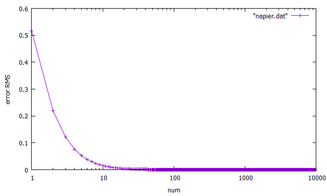

# 数値解析勉強用

## 更新履歴

### 2021/09/03
- [円周率を求めるプログラム](pi.c)を作成
- TODO：手法の説明もどこかにまとめる

### 2021/09/10
- [ネイピア数を求めるプログラム](napier.c)を作成
- ネイピア数との二乗誤差をgnuplot([スクリプト](napier.g))で可視化した

- 

## 参考資料

### 円周率を求める
- https://www.juen.ac.jp/math/nakagawa/openh20pi.pdf
- https://www.kurims.kyoto-u.ac.jp/~kenkyubu/kokai-koza/H16-ooura.pdf
- https://w3e.kanazawa-it.ac.jp/e-scimath/contents/t16/textbook_t16_all.pdf
